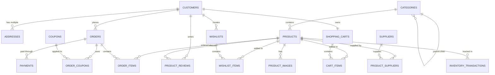

# E-commerce Store Database Management System

[](https://dev.mysql.com/downloads/)
[](LICENSE)
[](#database-schema)

A comprehensive MySQL database system designed for modern e-commerce applications, featuring complete customer management, product catalog, order processing, inventory tracking, and supplier management capabilities.

## 📋 Table of Contents

- [Overview](#overview)
- [Features](#features)
- [Database Schema](#database-schema)
- [Installation](#installation)
- [Usage](#usage)
- [Database Structure](#database-structure)
- [Sample Queries](#sample-queries)
- [Performance Optimization](#performance-optimization)
- [Contributing](#contributing)
- [License](#license)

## 🎯 Overview

This database management system provides a robust foundation for e-commerce applications with support for:

- **Multi-customer operations** with comprehensive user profiles
- **Hierarchical product categorization** with unlimited depth
- **Complete order lifecycle management** from cart to delivery
- **Advanced inventory tracking** with supplier relationships
- **Flexible payment processing** with multiple payment methods
- **Marketing tools** including coupons and wishlists
- **Product reviews and ratings** system
- **Multi-address support** for shipping and billing

## ✨ Features

### Customer Management
- Secure customer registration and authentication
- Multiple address management (billing/shipping)
- Customer profile management with demographics
- Wishlist creation and management

### Product Catalog
- Hierarchical category structure
- Product variants and attributes
- Multiple product images with ordering
- Stock quantity tracking
- SKU management
- Product reviews and ratings

### Order Management
- Shopping cart functionality
- Complete order lifecycle tracking
- Multiple payment method support
- Shipping method integration
- Order status tracking with history
- Refund and return processing

### Inventory Management
- Real-time stock tracking
- Inventory transaction logging
- Supplier relationship management
- Purchase order integration
- Low stock alerts capability

### Marketing & Analytics
- Coupon and discount system
- Customer segmentation support
- Order analytics ready structure
- Product performance metrics

## 🗄️ Database Schema

### Core Entity Relationships



### Detailed Schema Diagram

```mermaid
erDiagram
    CUSTOMERS {
        int customer_id PK
        varchar first_name
        varchar last_name
        varchar email UK
        varchar password_hash
        varchar phone_number
        date date_of_birth
        timestamp created_at
        timestamp updated_at
    }
    
    ADDRESSES {
        int address_id PK
        int customer_id FK
        enum address_type
        varchar street_address
        varchar city
        varchar state
        varchar country
        varchar postal_code
        boolean is_default
        timestamp created_at
    }
    
    CATEGORIES {
        int category_id PK
        varchar category_name UK
        text description
        int parent_category_id FK
        timestamp created_at
    }
    
    PRODUCTS {
        int product_id PK
        varchar product_name
        text description
        decimal price
        int category_id FK
        varchar sku UK
        int stock_quantity
        decimal weight
        boolean is_active
        timestamp created_at
        timestamp updated_at
    }
    
    PRODUCT_IMAGES {
        int image_id PK
        int product_id FK
        varchar image_url
        varchar alt_text
        boolean is_primary
        int display_order
        timestamp created_at
    }
    
    ORDERS {
        int order_id PK
        int customer_id FK
        timestamp order_date
        decimal total_amount
        enum status
        int shipping_address_id FK
        int billing_address_id FK
        decimal shipping_cost
        decimal tax_amount
        varchar payment_method
        varchar tracking_number
        text notes
    }
    
    ORDER_ITEMS {
        int order_item_id PK
        int order_id FK
        int product_id FK
        int quantity
        decimal unit_price
        decimal subtotal
    }
    
    PAYMENTS {
        int payment_id PK
        int order_id FK
        timestamp payment_date
        decimal amount
        varchar payment_method
        enum payment_status
        varchar transaction_id UK
        varchar card_last_four
        varchar card_brand
    }
    
    SUPPLIERS {
        int supplier_id PK
        varchar company_name
        varchar contact_name
        varchar email UK
        varchar phone_number
        text address
        boolean is_active
        timestamp created_at
    }
```



## 🚀 Installation

### Prerequisites

- MySQL 8.0 or higher
- Database client (MySQL Workbench, phpMyAdmin, or CLI)

### Setup Instructions

1. **Clone the repository**
   ```bash
   git clone https://github.com/yourusername/ecommerce-database.git
   cd ecommerce-database
   ```

2. **Create the database**
   ```sql
   mysql -u your_username -p < ecommerce_store.sql
   ```

3. **Verify installation**
   ```sql
   USE ecommerce_store;
   SHOW TABLES;
   ```

### Configuration

Update the connection parameters in your application:

```php
// Example PHP configuration
$config = [
    'host' => 'localhost',
    'database' => 'ecommerce_store',
    'username' => 'your_username',
    'password' => 'your_password',
    'charset' => 'utf8mb4'
];
```

## 📊 Database Structure

### Tables Overview

| Table Name | Purpose | Key Features |
|------------|---------|--------------|
| `customers` | User management | Secure authentication, profile data |
| `addresses` | Address storage | Multiple addresses per customer |
| `categories` | Product organization | Hierarchical structure |
| `products` | Product catalog | SKU tracking, inventory management |
| `orders` | Order processing | Complete lifecycle tracking |
| `payments` | Payment records | Multiple payment methods |
| `suppliers` | Vendor management | Supply chain integration |
| `coupons` | Promotions | Flexible discount system |

### Key Relationships

- **One-to-Many**: Customer → Orders, Product → Reviews
- **Many-to-Many**: Orders ↔ Coupons, Products ↔ Suppliers
- **Self-Referencing**: Categories (parent-child hierarchy)

## 🔍 Sample Queries

### Customer Analytics
```sql
-- Top customers by order value
SELECT 
    c.customer_id,
    CONCAT(c.first_name, ' ', c.last_name) as customer_name,
    COUNT(o.order_id) as total_orders,
    SUM(o.total_amount) as total_spent
FROM customers c
JOIN orders o ON c.customer_id = o.customer_id
WHERE o.status IN ('delivered', 'shipped')
GROUP BY c.customer_id
ORDER BY total_spent DESC
LIMIT 10;
```

### Product Performance
```sql
-- Best selling products
SELECT 
    p.product_name,
    p.sku,
    SUM(oi.quantity) as units_sold,
    AVG(pr.rating) as avg_rating,
    COUNT(pr.review_id) as review_count
FROM products p
JOIN order_items oi ON p.product_id = oi.product_id
LEFT JOIN product_reviews pr ON p.product_id = pr.product_id
GROUP BY p.product_id
ORDER BY units_sold DESC
LIMIT 20;
```

### Inventory Status
```sql
-- Low stock alert
SELECT 
    p.product_name,
    p.sku,
    p.stock_quantity,
    c.category_name
FROM products p
JOIN categories c ON p.category_id = c.category_id
WHERE p.stock_quantity < 10
AND p.is_active = TRUE
ORDER BY p.stock_quantity ASC;
```

## ⚡ Performance Optimization

### Indexes Implemented

- **Primary Keys**: All tables have optimized primary keys
- **Foreign Keys**: Proper referential integrity with indexes
- **Search Indexes**: Email, product names, SKUs, dates
- **Composite Indexes**: Customer orders, product categories

### Optimization Tips

1. **Query Optimization**
   ```sql
   -- Use indexes for filtering
   SELECT * FROM orders 
   WHERE customer_id = ? 
   AND order_date >= '2024-01-01';
   ```

2. **Pagination for Large Results**
   ```sql
   SELECT * FROM products 
   WHERE category_id = ?
   ORDER BY created_at DESC
   LIMIT 20 OFFSET ?;
   ```

3. **Aggregate Queries with Proper Grouping**
   ```sql
   SELECT 
       DATE(order_date) as order_day,
       COUNT(*) as daily_orders,
       SUM(total_amount) as daily_revenue
   FROM orders 
   WHERE order_date >= CURDATE() - INTERVAL 30 DAY
   GROUP BY DATE(order_date);
   ```

## 🛡️ Security Considerations

- **Password Security**: Store hashed passwords only
- **Data Validation**: Use CHECK constraints where applicable
- **Access Control**: Implement proper user roles and permissions
- **Audit Trail**: Track inventory and order changes
- **PCI Compliance**: Secure payment data handling

## 🤝 Contributing

We welcome contributions! Please see our [Contributing Guidelines](CONTRIBUTING.md) for details.

### Development Setup

1. Fork the repository
2. Create a feature branch
3. Make your changes
4. Add tests if applicable
5. Submit a pull request

### Reporting Issues

Please use the [GitHub Issues](https://github.com/yourusername/ecommerce-database/issues) page to report bugs or request features.

## 📈 Roadmap

- [ ] Add support for product variants (size, color, etc.)
- [ ] Implement advanced analytics tables
- [ ] Add multi-currency support
- [ ] Create stored procedures for common operations
- [ ] Add data archiving strategies
- [ ] Implement real-time inventory sync

## 📄 License

This project is licensed under the MIT License - see the [LICENSE](LICENSE) file for details.

## 🙋‍♂️ Support

For support and questions:

- 📧 Email: support@yourcompany.com
- 💬 Discussion: [GitHub Discussions](https://github.com/yourusername/ecommerce-database/discussions)
- 📖 Wiki: [Project Wiki](https://github.com/yourusername/ecommerce-database/wiki)

---

⭐ **Star this repository if you found it helpful!**
